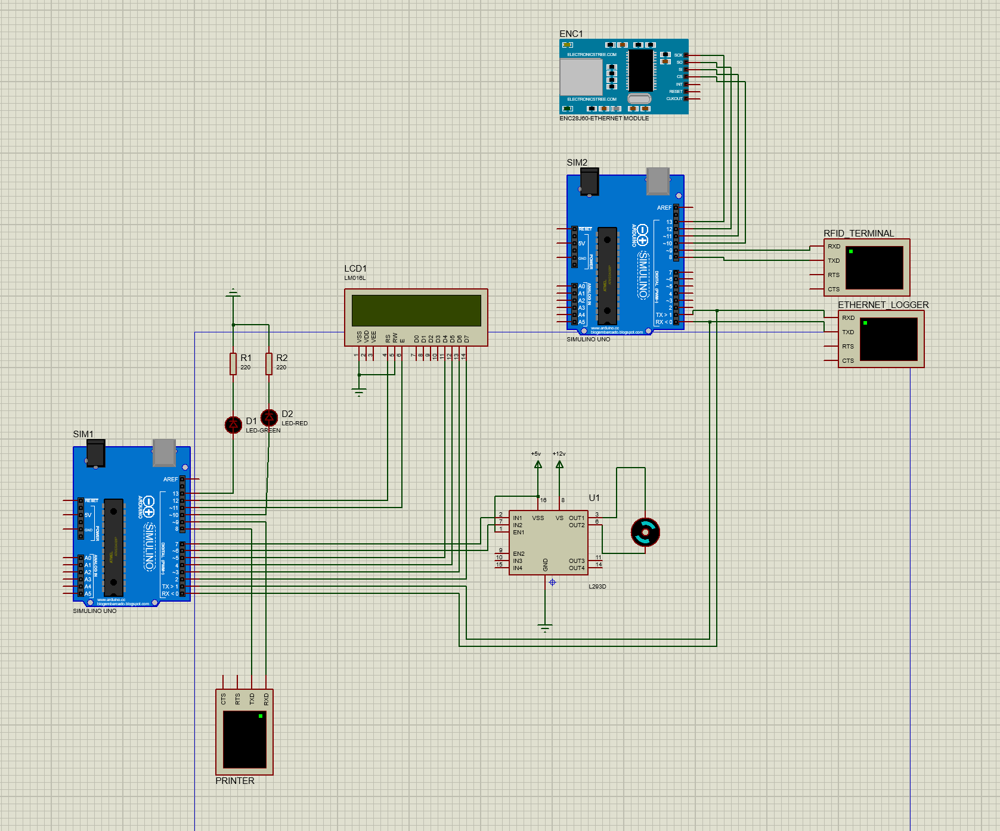

# Entrance Control Cloud

This project is about to implement a cloud-based entrance control system. The system consists of a cloud server and a client. The client is a microcontroller that is connected to a RFID reader and a DC motor. The server is a cloud server that is responsible for authenticating the users and controlling the entrance. The server is also responsible for monitoring the entrance and keeping the entrance history.

- [Requirements](#requirements)
- [Structure and Implementation](#structure-and-implementation)
  - [Client](#client)
    - [Application](#application)
    - [MainWindow](#mainwindow)
    - [HistoryWindow](#historywindow)
    - [WebSocketClient](#websocketclient)
    - [WebSocketRequest](#websocketrequest)
    - [Button](#button)
    - [Label](#label)
    - [TextField](#textfield)
  - [Control Cloud](#control-cloud)
    - [HttpServer](#httpserver)
    - [WebSocketServer](#websocketserver)
    - [EntranceRecord](#entrancerecord)
    - [EntranceHistory](#entrancehistory)
    - [Authenticator](#authenticator)
    - [MonitoringSystemUser](#monitoringsystemuser)
    - [MonitoringSystemAuthenticator](#monitoringsystemauthenticator)
  - [Proteus Simulation](#proteus-simulation)
  - [Embedded Part](#embedded-part)
    - [Handling the Ethernet Connection and RFID Reader](#handling-the-ethernet-connection-and-rfid-reader)
    - [Handling the DC Motor and LEDs](#handling-the-dc-motor-and-leds)
- [Contributions](#contributions)


## Requirements

For this project, Proteus simulation software, Arduino IDE, and QT Creator are required to be installed on your system. To communicate with the Internet and send data, we need a hardware to send and receive data wirelessly, which is done with the help of ESP8266 wifi module. To control the modules we need the Arduino board.

## Client

In the client section, several essential tasks are performed. Firstly, an observer can send a request to authenticate themselves to the server. Upon successful authentication, he can view the login history of users or real-time information about the logged-in user. Additionally, whenever someone enters through RFID, a message is received via the server, displaying the user's information to the observer. Moreover, the observer can retrieve the login history of users.

## Application

The `CPS::Application` class oversees critical operations such as initializing the main application window, managing WebSocket communications with the server, handling the display of historical data and receiving user's data from the server.
In the constructor of the `Application` class, new instances of `MainWindow`, `HistoryWindow`, and `WebSocketClient` are created, and connections are established between various signals and slots to handle user interactions and WebSocket events within the application. The `show` method displays the main window of the application. The `showHistoryWindow` method presents the received historical data within the history window.

```cpp
namespace CPS {

class Application : public QObject
{
    Q_OBJECT

public:
    explicit Application(QObject *parent = nullptr);
    ~Application();
    void show();

Q_SIGNALS:

private Q_SLOTS:
    void showHistoryWindow(const QJsonArray &history);

private:

private:
    MainWindow    *_window;
    HistoryWindow *_history;
    WebSocketClient *_webSocket;
};
}
```

## MainWindow

The `CPS::MainWindow` class is responsible for creating and managing the main window of the CPS application. It sets up the UI components such as text fields, labels, and buttons, establishes connections for user interactions, and manages layout and styling for controlling and monitoring the system.
The constructor initializes various UI components such as text fields, labels, and buttons, sets up layout managers for organizing these components, and applies global styling to ensure a consistent appearance. `setTime`, `setDate` and `setUsername` methods update the displayed time, date, and username within the main window of the application. This class has two signals, one of which is for the button to connect to the server and the other is to show the history of users' logins. `changeRightPanelEnabled` method enables or disables all widgets contained within the right panel layout based on the provided boolean value. `showUserDetails` method updates the main window with user details by setting the displayed date, time, and username using the provided data. `setupConnections` is used for button clicks, emitting signals to perform actions such as attempting a server connection or displaying the history. `setupGlobalStyle` configures the global style of the main window by setting its size limits, background color, window icon, title, and palette colors. `setupWindowLayout` organizes the layout of the main window by adding the right panel and left panel layouts to the main layout manager. `setupHeader` method sets up the header label of the main window. `setupRightPanel` and `setupLeftPanel` position and configure the widgets within the left and right panels of the main window, adjusting their layout based on window dimensions and margins. `closeEvent` method overrides the default close event handling, hiding the window instead of closing it, and then exiting the application.

```cpp
namespace CPS {

class MainWindow : public QMainWindow
{
    Q_OBJECT

public:
    MainWindow(QWidget *parent = nullptr);
    ~MainWindow();

    void setTime(const QString& time);
    void setDate(const QString& date);
    void setUsername(const QString& username);

Q_SIGNALS:
    void historyuBtnClicked();
    void connectBtnClicked(const QString &address, const QString &username, const QString &password);

public Q_SLOTS:
    void changeRightPanelEnabled(bool enabled);
    void showUserDetails(const QString &username, const QString &date, const QString &time);

private:
    void setupConnections();
    void setupGlobalStyle();
    void setupWindowLayout();
    void setupHeader();
    void setupRightPanel();
    void setupLeftPanel();
    void closeEvent(QCloseEvent *event) override;

private:
    Button      *_connectBtn;
    TextField   *_addressInput;
    TextField   *_usernameInput;
    TextField   *_passwordInput;

    Label       *_date;
    Label       *_time;
    Label       *_username;
    Button      *_historyBtn;

    QVBoxLayout *_leftPanel;
    QHBoxLayout *_mainLayout;
    QVBoxLayout *_rightPanel;

    const int _windowMargin = 30;
};
}
```

## HistoryWindow

The `CPS::HistoryWindow` class creates a window widget to display historical data within the CPS application, formatting and presenting the data in a list format, and clearing the list upon window closure.
In the constructor of the `HistoryWindow` class, a widget is created to display historical data, with specific styling and dimensions set for the window. Additionally, a list widget is created and positioned within the window to present the historical data in a formatted manner. `show` method displays data from the provided JSON array in the history window, formatting and presenting each entry in a list format. `closeEvent` method clears the list of entries in the history window upon closure.

```cpp
namespace CPS {

class HistoryWindow : public QWidget
{
    Q_OBJECT
public:
    explicit HistoryWindow(QWidget *parent = nullptr);
    ~HistoryWindow();

    void show(const QJsonArray &array);

private:
    void closeEvent(QCloseEvent * event) override;

private:
    QListWidget *_list;
};
}
```

## WebSocketClient

The `CPS::WebSocketClient` class manages WebSocket communication within the CPS application, handling authentication, retrieving historical data, and processing real-time RFID events from the server. It emits signals to notify UI components of new users, changes in connection status, and the availability of historical data, facilitating real-time monitoring and control of the system.
In the constructor, the `WebSocketClient` class establishes connections to handle WebSocket events such as connection establishment, error occurrences, and reception of text messages. Signals in this class convey various events: `newUser` signals a new user event with username, date, and time; `connectionChanged` indicates changes in connection status; `historyReady` signifies availability of historical data in a QJsonArray. `errorOccurred` method handles WebSocket errors by logging the error and emitting a signal to indicate a change in connection status, informing the application of the error condition. After successfully connecting to the server, `connected` method sends an authentication request with the username and password, logging the process. `findRequest` method handles incoming WebSocket data, determining its type, and triggering appropriate actions like notifying about historical data, authentication status, or new RFID events, enabling event handling in the application. `findResponseType` method categorizes the type of response from the server based on the JSON document's structure, helping in handling server responses in the application. `connectToServer` method initiates a connection to the server using the provided address, username, and password, emitting a signal to indicate the connection status. `getHistory` method requests historical data from the server by sending a message through the WebSocket, utilizing a predefined request format to retrieve the history of events or actions.

```cpp
namespace CPS {

class WebSocketClient : public QObject
{
    Q_OBJECT
public:
    enum class ResponseType {
        Authenticate,
        History,
        RFID
    };

    explicit WebSocketClient(QObject *parent = nullptr);

Q_SIGNALS:
    void newUser(const QString &username, const QString &date, const QString &time);
    void connectionChanged(bool enabled);
    void historyReady(const QJsonArray &history);

public Q_SLOTS:
    void connectToServer(const QString &address, const QString &username, const QString &password);
    void getHistory();

private Q_SLOTS:
    void connected();
    void errorOccurred(QAbstractSocket::SocketError error);
    void findRequest(const QString &data);

private:
    ResponseType findResponseType(const QJsonDocument &jsonDocument);

private:
    QWebSocket _webSocket;
    WebSocketRequest _request;

    QString _username;
    QString _password;
};

} // end of CPS
```

## WebSocketRequest

The `CPS::WebSocketRequest` class facilitates the creation of WebSocket requests for authentication and historical data retrieval. It generates JSON-formatted requests containing necessary authentication credentials or instructions for history data retrieval.
`authenticationRequest` method constructs a JSON-formatted authentication request by creating a JSON object with a specified type **authenticate** and including the provided username and password in the data object. `historyRequest` constructs a JSON request of type **history** with an empty data object. It's used to request historical data from the server.

```cpp
namespace CPS {

class WebSocketRequest
{
public:
    WebSocketRequest();
    QString authenticationRequest(const QString &username, const QString &password);
    QString historyRequest();
};

}
```

## Button

This class defines a customized QPushButton widget, which is designed for the CPS application. It ensures a consistent appearance and behavior for buttons throughout the application, with a specific text label, font size, and style defined in its constructor.

```cpp
namespace CPS {

class Button : public QPushButton
{
    Q_OBJECT
public:
    explicit Button(const QString &text, QWidget *parent = nullptr);

signals:
};

}
```

## Label

The `Label` class defines a custom label widget in Qt. Its constructor initializes the label's appearance by setting its font size, minimum and maximum height, margin, and text content.

```cpp
namespace CPS {

class Label : public QLabel
{
    Q_OBJECT
public:
    explicit Label(const QString &text, QWidget *parent = nullptr);

signals:
};

} // end of CPS
```

## TextField

The `TextField` class defines a custom text field widget in Qt, inheriting from `QLineEdit`. Its constructor initializes the text field's appearance by setting properties such as font size, minimum and maximum height, text margins, placeholder text, and style sheet.

```cpp
namespace CPS {

class TextField : public QLineEdit
{
    Q_OBJECT
public:
    explicit TextField(const QString &placeholderText, QWidget *parent = nullptr);

signals:
};

}
```

## Control Cloud

It is the server-side that contains a list of valid users who can enter the company. Web server and Arduino board communicate with http protocol. The server is also responsible for authenticating the users, monitoring the entrance and keeping the entrance history. The server is implemented in C++ using the QT framework. The server has two main components: HttpServer and WebSocketServer.

## HttpServer

The `HttpServer` is responsible for handling the HTTP requests. Incoming requests are processed through the `handleRequest()` method, which parses incoming JSON payloads, particularly focusing on RFID data. Depending on the request type, the server verifies RFID authentication with the provided `Authenticator` instance and sends a response accordingly. The server also manages the entrance history by emitting signals for new entrance records and saving them to the history file. The `startServer()` method initializes the HTTP server and listens for incoming requests, while the `stopServer()` method stops the server.

```cpp
class HttpServer : public QObject
{
    Q_OBJECT

public:
    HttpServer(Authenticator* authenticator, const QHostAddress &address = QHostAddress::LocalHost, quint16 port = 5050, QObject *parent = nullptr);
    ~HttpServer();
    void startServer();
    void stopServer();
    QHttpServerResponse handleRequest(const QHttpServerRequest &req);

Q_SIGNALS:
    void serverStarted(const QHostAddress &address, quint16 port);
    void serverStopped();
    void requestReceived(const QHttpServerRequest *req, QHttpServerResponse *resp);
    void newEntraceRecord(EntranceRecord *record);

public slots:

private slots:

private:
    QHostAddress m_address;
    quint16 m_port;
    QHttpServer *m_server;
    Authenticator *m_authenticator;
};
```

## WebSocketServer

WebSocketServer is responsible for handling the websocket requests. It listens to the incoming requests and sends the response back. The server is responsible for authenticating users and showing the entrance history.

The `WebSocketServer` class sets up a WebSocket server using `QWebSocketServer` and listens on the specified address and port. The `onNewConnection` method is connected to the `newConnection` signal of the WebSocket server, which is triggered when a new WebSocket connection is established. The `processTextMessage` method handles incoming text messages from clients and performs various actions based on the message content. The class also includes methods for sending history, authentication responses, entrance records, and handling client disconnections. The `socketDisconnected` method handles client disconnections and resets the authentication status.

```cpp
class WebSocketServer : public QObject
{
    Q_OBJECT

public:
    WebSocketServer(const QHostAddress &address, quint16 port = 5051, QObject *parent = nullptr);

Q_SIGNALS:
    void historyRequested();
    void authenticateRequested(const QString &username, const QString &password);

public slots:
    void sendHistory(const QJsonDocument &jsonDoc);
    void sendAuthenticate();
    void sendUnauthenticate();
    void sendEntranceRecord(EntranceRecord *record);

private slots:
    void onNewConnection();
    void processTextMessage(const QString &message);
    void socketDisconnected();

private:
    QHostAddress m_address;
    quint16 m_port;
    QWebSocketServer *m_server;
    QWebSocket *m_client_socket;
    bool m_isAuthenticated = false;
};
```

## EntranceRecord

`EntranceRecord` is a class that contains the RFID tag, entrance time, and permission status of the user. The class provides methods to permit or deny access to the user and emits a signal when the permission status changes.

```cpp
class EntranceRecord : public QObject
{
    Q_OBJECT

public:
    EntranceRecord(QString rfidTag, QObject *parent = nullptr);
    EntranceRecord(QString rfidTag, QDateTime entranceTime, QObject *parent = nullptr);
    EntranceRecord(QString rfidTag, bool isPermitted, QObject *parent = nullptr);
    EntranceRecord(QString rfidTag, QString entranceTime, QString isPermitted, QObject *parent = nullptr); // (1
    ~EntranceRecord();
    QString rfidTag() const;
    QDateTime entranceTime() const;
    bool isPermitted() const;
    void permit();
    void deny();

Q_SIGNALS:
    void permissionChanged(bool isPermitted);

private:
    QString m_rfidTag;
    QDateTime m_entranceTime;
    bool m_isPermitted;
}
```

## EntranceHistory

`EntranceHistory` is a class that manages the history of entrance records. It loads the entrance records from a file, saves the records to the file, and provides methods to retrieve and add entrance records. The class also converts the entrance records to JSON format and emits a signal when the History is requested.

```cpp
class EntranceHistory : public QObject
{
    Q_OBJECT

public:
    EntranceHistory(QString entranceHistoryPath, QObject *parent = nullptr);
    ~EntranceHistory();
    QVector<EntranceRecord *> getEntranceRecords(int maxRecords = 10);
    QJsonDocument convertToJson(const QVector<EntranceRecord *> &records);

Q_SIGNALS:
    void getEntranceRecordsRequested(const QJsonDocument &jsonDo);

public slots:
    void saveEntranceRecords();
    void getEntranceRecordsHistory();
    void addEntranceRecord(EntranceRecord *record);

private:
    int m_lastRecordIndex = 0;
    QString m_entranceHistoryPath;
    QVector<EntranceRecord *> m_entranceRecords;
    void loadEntranceRecords();
};
```

## Authenticator

`Authenticator` is a class that manages the permitted RFID tags. It loads the permitted tags from a file and provides a method to check if a tag is in permitted tags or not..

```cpp
class Authenticator : public QObject
{
    Q_OBJECT

public:
    Authenticator(QString permittedTagsPath, QObject *parent = nullptr);
    ~Authenticator();
    bool isPermitted(const QString &tag);

private:
    QString m_permittedTagsPath;
    QVector<QString> m_permittedTags;
    void loadPermittedTags();
    void savePermittedTags();
};
```

## MonitoringSystemUser

`MonitoringSystemUser` is a class that represents a user of the monitoring system. It contains the username and password of the user and provides methods to get the username and validate the password.

```cpp
class MonitoringSystemUser : public QObject
{
    Q_OBJECT

public:
    MonitoringSystemUser(QString username, QString password, QObject *parent = nullptr);
    ~MonitoringSystemUser();
    QString getUsername() const;
    bool validatePassword(const QString &password) const;

Q_SIGNALS:

private:
    QString m_username;
    QString m_password;
};
```

## MonitoringSystemAuthenticator

`MonitoringSystemAuthenticator` is a class that is responsible for authenticating the users of the monitoring system. It contains the list of users and the path to the file that contains the users. By starting the server, the users are loaded from the file.

```cpp
class MonitoringSystemAuthenticator : public QObject
{
    Q_OBJECT
public:
    MonitoringSystemAuthenticator(const QString &systemUserPath, QObject *parent = nullptr);
    ~MonitoringSystemAuthenticator();

Q_SIGNALS:
    void authenticated();
    void unauthenticated();

public Q_SLOTS:
    void authenticate(const QString &username, const QString &password);

private:
    void loadMonitoringSystemUsers();

    QString m_systemUserPath;
    QVector<MonitoringSystemUser *> m_monitoringSystemUsers;
};
```

## Proteus Simulation

As we can see the image of the Proteus simulation consists of the following components:
- Two Arduino boards - one foe handling the ethernet connection and handling the RFID reader and the other for handling the DC motor, LEDs, and DC motor.
- ENC28J60 Ethernet Module - for handling the ethernet connection.
- RFID Reader - for reading the RFID tags.
- DC Motor - for controlling the entrance.
- LEDs - for indicating the status of the entrance.
- LM016L LCD - for displaying the status of the entrance (access denied or not).

In order to handle the communication between the two Arduino boards, we connect the Rx pin of the Arduino board that handles the DC motor to the Tx pin of the Arduino board that handles the RFID reader. By doing this, we receive the server response from the Arduino connected to the ethernet module and write it on `Serial` port. The other Arduino board reads the response from the `Serial` port and controls the DC motor and LEDs accordingly.

## Embedded Part
 In the embedded part, we have two Arduino boards. One of them is responsible for handling the RFID reader and the other is responsible for handling the DC motor and LEDs. The Arduino board that handles the RFID reader sends the RFID tag to the server and receives the response from the server so we need to have an `.ino` file for each Arduino board.

### Handling the Ethernet Connection and RFID Reader
In order to handle the ethernet connection we installed the `Microsoft KM-TEST Loopback Adapter` and set the IP address of the ethernet module to an unused IP address in the network in our computer. The ip address is `169.254.238.215` in this case. The mac address is also a unique address that is used to identify the ethernet module in the network. Also we set the ip address in Ethernet module in Proteus to `169.254.238.215` which is also the gateway address in Arduino code. 
```ino
static byte myip[] = { 169, 254, 238, 216 };
static byte gwip[] = { 169, 254, 238, 215 };
static byte mymac[] = { 0x74, 0x69, 0x69, 0x2D, 0x30, 0x31 };
static byte serverip[] = { 169, 254, 238, 215 };
```

The default pins for connecting terminal are Tx and Rx pins of the Arduino board. In order to add another terminal to the Arduino board, we need to use the `SoftwareSerial` library And connect the terminal to ports `8` and `9` instead of the default Rx and Tx pins. 

```ino 
The Arduino code consists of two main parts:
- `setup()` function: In this function, we initialize the ethernet module, RFID reader, and serial communication. We set the `BAUD_RATE` to 9600 which is a common baud rate for serial communication. We also set the `persistTcpConnection` to `true` so that the connection is persistent. `ether.copyIP()` function is used to copy the IP address of the server to the ethernet module. 

```ino
void setup() {
  tagScanner.begin(BAUD_RATE);
  Serial.begin(BAUD_RATE);

  ether.begin(sizeof Ethernet::buffer, mymac, SS);
  ether.staticSetup(myip, gwip);
  ether.copyIp(ether.hisip, serverip);
  ether.persistTcpConnection(true);
} 
```
- `loop()` function: This function runs continuously. In this function, we read the RFID tag and send it to the server. We also receive the response from the server and control the DC motor and LEDs accordingly. 

```ino
void loop() {
  char rfidTag[DIGIT_COUNT];
  word pos = ether.packetLoop(ether.packetReceive());
  if (readRfid(rfidTag)) {
        sendToServer(rfidTag);
  }
  recieveFromServer(rfidTag);
}
```
**`readRfid()`:**  We read the RFID tag by using the `readRfid()` function. In this function, we read the RFID tag character by character and store it in a string. When the number of characters is equal to the `DIGIT_COUNT` which is 10 in this case, we copy the RFID tag to the `rfidTag` array and return true. 

```ino
String rfid = "";
char c;
int charCount = 0;

bool readRfid(char rfidTag[]) {
  while(tagScanner.available()>0) {
    c = tagScanner.read(); 
    charCount++;
    rfid += c;
    if (charCount == DIGIT_COUNT) {
      strcpy(rfidTag, rfid.c_str());
      rfid = "";
      charCount = 0;
      return true; 
    }
  }
  return false;
}
```

**`sendToServer()`:** We send the RFID tag to the server by using the `sendToServer()` function. In this function, we create a JSON object that contains the RFID tag and send it to the server. We an instance of `Stash` class to create the JSON object. We use the `stash.print()` function to add the RFID tag to the JSON object. We then save the JSON object and send it to the server. Stash saves the JSON object in the memory and prepares the HTTP request to send it to the server. 

```ino
void sendToServer(char rfidTag[]) {
    byte sd = stash.create();
    stash.print("{");
    stash.print("\r\"type\": \"rfid\",");
    stash.print("\r\"data\": {");
    stash.print("\r\r\"tag\": ");
    stash.print("\"");
    for (int i = 0; rfidTag[i] != '\0'; i++) {
        stash.print(rfidTag[i]);
    }
    stash.print("\"");
    stash.print("\r}");
    stash.print("}");
    stash.save();

    Stash::prepare(PSTR("POST http://$F/ HTTP/1.1" "\r\n"
                  "Host: $F" "\r\n"
                  "Content-Length: $D" "\r\n"
                  "Content-Type: application/json" "\r\n"
                  "\r\n"
                  "$H"),
    server, server, stash.size(), sd);
    session = ether.tcpSend();
}
```
**`recieveFromServer()`:** We receive the response from the server by using the recieveFromServer() function. In this function, we parse the response and print the status code and the RFID tag to the serial port in order to use it in the other Arduino board for controlling the DC motor and LEDs. 

```ino
void recieveFromServer(char rfidTag[]) {
  char* response = ether.tcpReply(session);
  if (response != nullptr) {
    const char* statusStart = strstr(response, "HTTP/1.1 ");
    if (statusStart != NULL) {
        statusStart += strlen("HTTP/1.1 ");
        int statusCode;
        sscanf(statusStart, "%d", &statusCode);
        Serial.print(statusCode);
        Serial.print(":");
        for (int i = 0; i < DIGIT_COUNT; i++) {
          Serial.print(rfidTag[i]);
        }
    }
  }
}
```

### Handling the DC Motor and LEDs
In order to handle the DC motor and LEDs, we need to have an `.ino` file for the Arduino board that handles the DC motor and LEDs.

We make Status struct in order to keep the status of the system and turn off the LEDs and DC motor after a certain time. 

```ino
const int rs = 12, en = 11, d4 = 5, d5 = 4, d6 = 3, d7 = 2;
LiquidCrystal lcd(rs, en, d4, d5, d6, d7);
AltSoftSerial resPrinter;

struct Status {
  bool isRedLedOn;
  bool isGreenLedOn;
  bool isPrintedOnMonitor;
  bool isDoorOpen;

  unsigned long lastTimeRedLedOn;
  unsigned long lastTimeGreenLedOn;
  unsigned long lastTimeMonitorPrinted;
  unsigned long lastTimeDoorOpen;
};
```

We also define the pins for the LEDs, and DC motor, and LCD screen. 

```ino
#define GREEN_LED 13
#define RED_LED 10
#define MOTOR_IN1 7
#define MOTOR_IN2 6
#define DELAY 30000
#define DELAY_RED_LED 3000
#define BAUD_RATE 9600
#define DIGIT_COUNT 10
#define DELAY_FOR_90_DEGREES_CLOCKWISE 95
#define DELAY_FOR_90_DEGREES_COUNTERCLOCKWISE 82
#define SUCCESS_CODE 200
#define FAILURE_CODE 403
#define ACCESS_DENIED "Access Denied!"

const int rs = 12, en = 11, d4 = 5, d5 = 4, d6 = 3, d7 = 2;
LiquidCrystal lcd(rs, en, d4, d5, d6, d7);
AltSoftSerial resPrinter;
```
**`setup():`** In the setup function, we initialize the serial communication, pins for the LEDs, DC motor, and LCD screen. We also set the baud rate to 9600.

```ino
void setup() {
  Serial.begin(BAUD_RATE);
  resPrinter.begin(BAUD_RATE);
  pinMode(MOTOR_IN1, OUTPUT);
  pinMode(MOTOR_IN2, OUTPUT);
  pinMode(GREEN_LED, OUTPUT);
  pinMode(RED_LED, OUTPUT);

  lcd.begin(20, 4);
  lcd.print("Scan your TAG");
}
```

**`loop():`** In the loop function, we read the status code and RFID tag from the serial port. We then control the DC motor and LEDs accordingly. Also we print the status of the system on the LCD screen. In the end, we check the status of the system and close the door or turn off LEDs if needed.

```ino
void loop() {
  if (readRfid(res)) {
    lcd.clear();
    strcpy(status, res);
    status[3] = '\0'; 
    strcpy(rfid, res);
    resPrinter.println(status);
    resPrinter.println(rfid);
    statusCode = atoi(status);
    if (statusCode == SUCCESS_CODE) {
      accessGranted(rfid);
    }
    else if (statusCode == FAILURE_CODE) {
      accessDenied();
    }
    memset(res, '\0', sizeof(res));
    memset(rfid, '\0', sizeof(rfid));
  }
  checkStatus();
}
```

**`turnOnGreenLed():`** This function is used to turn on the green LED. In this function, we check if the red LED is on. If it is on, we turn it off. We then turn on the green LED and set the `isGreenLedOn` to true. We also set the `lastTimeGreenLedOn` to the current time.
```ino
void turnOnGreenLed() {
  if (currentStatus.isRedLedOn) {
    turnOffRedLed();
  }
  digitalWrite(GREEN_LED, HIGH);
  currentStatus.isGreenLedOn = true;
  currentStatus.lastTimeGreenLedOn = millis();
}
```

**`turnOffGreenLed():`** does the opposite of the `turnOnGreenLed()` function. It turns off the green LED and sets the `isGreenLedOn` to false. 

```ino
void turnOffGreenLed() {
  digitalWrite(GREEN_LED, LOW);
  currentStatus.isGreenLedOn = false;
}
```

`turnOnRedLed():` and `turnOffRedLed()` implementations are also the same.

**`openDoor():`** This function is used to open the door. In this function, we turn the DC motor clockwise for 90 degrees (This is done by setting a delay) and set the `isDoorOpen` to true. We also set the `lastTimeDoorOpen` to the current time. 

```ino
void openDoor() {
  digitalWrite(MOTOR_IN1, HIGH);
  digitalWrite(MOTOR_IN2, LOW);
  currentStatus.isDoorOpen = true;
  currentStatus.lastTimeDoorOpen = millis();
  delay(DELAY_FOR_90_DEGREES_CLOCKWISE);
  digitalWrite(MOTOR_IN1, LOW);
  digitalWrite(MOTOR_IN2, LOW);
}
```

`closeDoor():` function does the opposite of the `openDoor()` function. It closes the door by turning the DC motor counterclockwise for 90 degrees.

**`checkStatus():`** This function gets the current time and checks the status of the system. If the red LED is on and the current time minus the last time the red LED was turned on is greater than the delay for the red LED, we turn off the red LED. We do the same for the green LED, door, and LCD screen. The `millis()` function returns 
```ino
void checkStatus() {
  long unsigned int currentTime = millis();
  if (currentStatus.isRedLedOn && currentTime - currentStatus.lastTimeRedLedOn >= DELAY_RED_LED) {
    turnOffRedLed();
  }
  if (currentStatus.isGreenLedOn && currentTime - currentStatus.lastTimeGreenLedOn >= DELAY) {
    turnOffGreenLed();
  }
  if (currentStatus.isDoorOpen && currentTime - currentStatus.lastTimeDoorOpen >= DELAY) {
    closeDoor();
  }
  if (currentStatus.isPrintedOnMonitor && currentTime - currentStatus.lastTimeMonitorPrinted >= DELAY) {
    lcd.clear();
    currentStatus.isPrintedOnMonitor = false;
  }
}
```

**`accessGranted():`** In this function, we turn on the green LED, open the door, and print the RFID tag on the LCD screen. Setting the LCD cursor to the first row is done by using the `lcd.setCursor()` function.

```ino
void accessGranted(char rfid[]) {
  lcd.setCursor(0, 1);
  lcd.print(rfid);
  currentStatus.isPrintedOnMonitor = true;
  currentStatus.lastTimeMonitorPrinted = millis();
  turnOnGreenLed();
  openDoor();
}
```
**`accessDenied():`** In this function, we turn on the red LED, close the door, and print the `ACCESS_DENIED` message on the LCD screen. We also check if the door is open and close it if it is open.

```ino
void accessDenied() {
  lcd.setCursor(0, 1);
  lcd.print(ACCESS_DENIED);
  currentStatus.isPrintedOnMonitor = true;
  currentStatus.lastTimeMonitorPrinted = millis();
  turnOnRedLed();
  if (currentStatus.isDoorOpen) {
      lcd.clear();
      closeDoor();
  }
}
```
